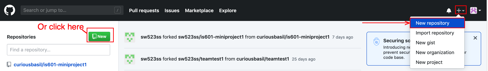
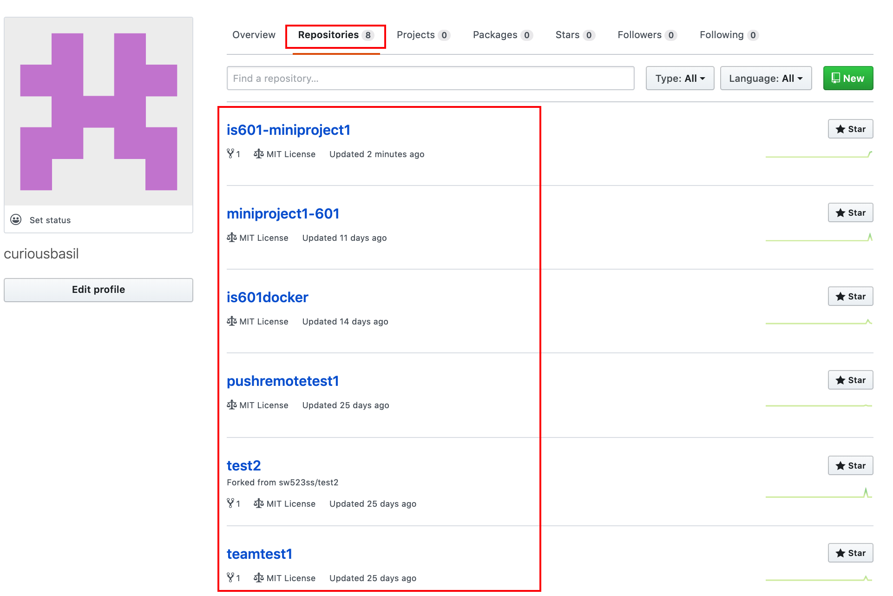

Git Tutorial 101 : Concepts and Definitions
---
## Repository:
 
### In simple Terms:

A Repository is a folder that holds All files of a specific project on Github.
 
### Some Detail:

The Person that created the repository can share the URL with others who will also be working on this project. From there, members can clone a repository and save is on their local computer to start working on developing the project and add their part to it as designated by the team leader.

### To visualize:
Creating a new Repository

To See List of Repositories

---

## Clone: 

### In simple Terms:

Cloning makes a copy of a repository on Github on a local computer.

### Some Detail:

When a Team member working on a project is designated some work on it, they will make a copy of the repository on their local computer to work on developing the project by using the clone command.

### To visualize:

To clone a repository, we go to the repository page and click on the Green Clone button as shown below. This can be done Via HTTPS or SSH

---

## Fork:

### In Simple Terms:
Forking is making a copy of a master repository in your github account.

### Some Detail:

When a team is working on a project and a team member wishes to create a copy of a master repository into their repository, they would Fork it into their repository to start working on the project

---
## Branch:

### In Simple Terms:
Branching is when a  new branch is created from the main line to continue to develop a project without changing the main.

### Some Detail:
When a developer is working on a project and wishes to add a fix, a task or a feature to a project without changing the main project files. It allows a developed to work on a projects master branch and a 2nd branch (or more) in parallel so that the work on a 2nd branch doesn't affect the work on the master branch.

### To Visualize:

Below is a screenshot from the terminal window. It shows that typing "git branch <name>" creates a new branch off the master branch. Typing "git checkout <name>" moves us from working on a master branch to the branch sepcified in the command line and typing only "git branch" Shows us what branch we are currently on. Any changes in the specified branch will NOT affect the master branch until the developer merges his branches together. Like this, a developer can work on multiple versions of a project in parallel without comprimising the original work on the master.

---
---

## Commit:

### In Simple Terms:

### Some Detail:

---

## Merge:

### In Simple Terms:

### Some Detail:

---

## Checkout:

### In Simple Terms:

### Some Detail:

---

## Push:

### In Simple Terms:

### Some Detail:

---
## Pull:

### In Simple Terms:

### Some Detail:

---

## Remote Add / Remove / Show:

### In Simple Terms:

### Some Detail:

---

## Status:

### In Simple Terms:

### Some Detail:

---

## Master Branch:

### In Simple Terms:

### Some Detail:

---
---
# Changelog

- [x] Repository ~ Faisal
- [x] Clone ~ Faisal
- [x] Fork ~Faisal
- [ ] Branch
- [ ] Commit
- [ ] Merge
- [ ] Checkout
- [ ] Push
- [ ] Pull
- [ ] Remote Add / Remove / Show
- [ ] Status
- [ ] Master Branch

